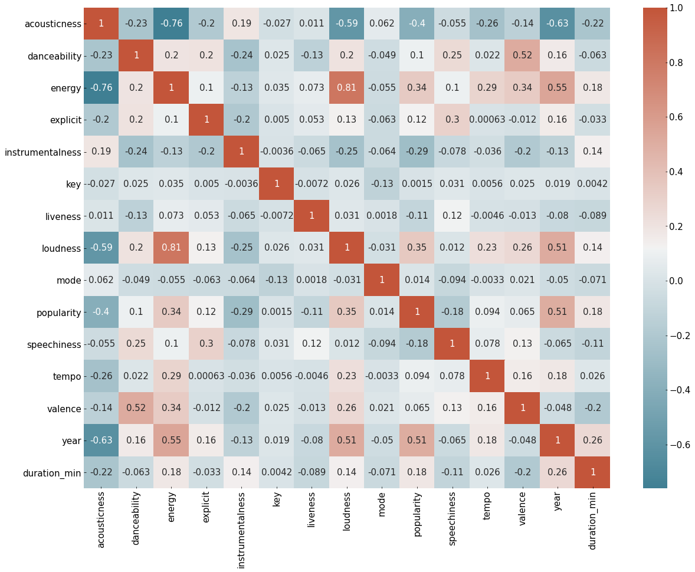
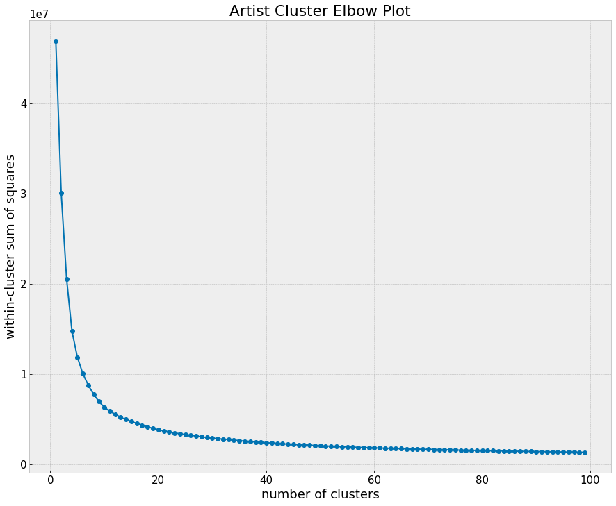
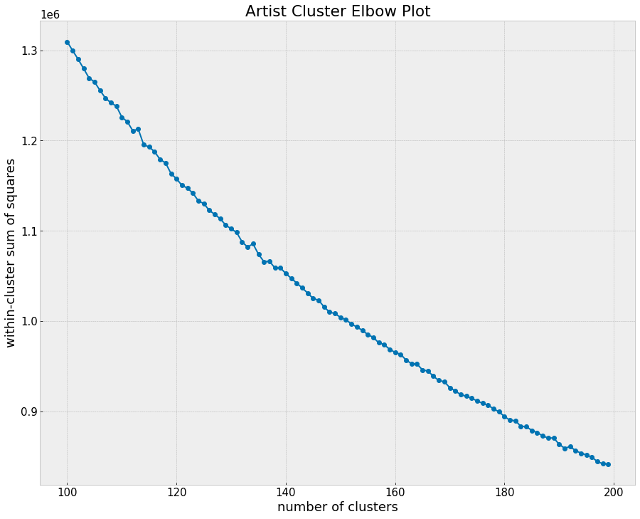
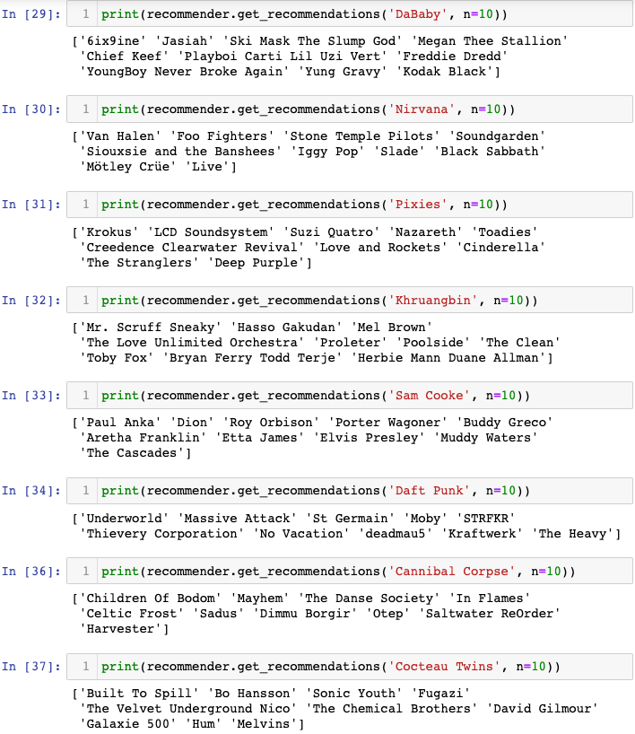
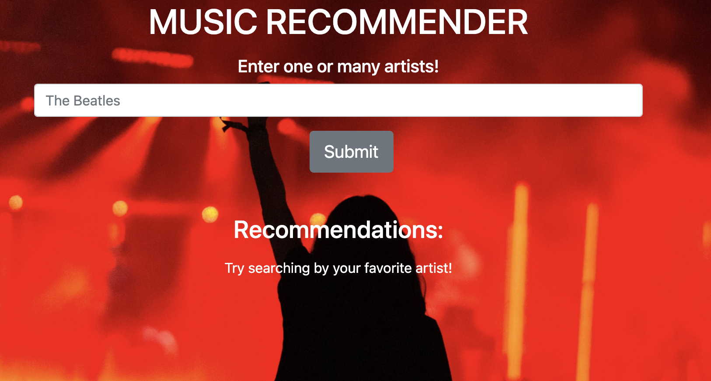

# Music Recommeder System Using Spotify data

---------------------------------

## Overview

* The data consist of 174,389 Spotify songs spanning 3,232 genres.
* The overall goal of this project was to build a functioning recommender system that can provide accurate recommendations based on a preferred artist.
* Out of all the distance measures tested, cosine similarity performed the best.
* After building the recommender, a web app was developed to demonstrate the recommender's use.

--------------------------------------------------------------------

## The Data

[Link to Data](https://www.kaggle.com/yamaerenay/spotify-dataset-19212020-160k-tracks)

The full dataset contains 174,389 songs and 19 features associated with each song's attributes:
* Acousticness
* Danceability
* Liveness
* Popularity

The earliest song in the dataset was released in 1920, and the latest in 2021.

### Some noteworth relationships between features using Spearman's rank correlation coefficient:

* Valence and Danceability: 0.52
* Energy and Year: 0.55
* Loudness and Year: 0.51
* Loudness and Popularity: 0.35
* Loudness and Energy: 0.81
* Year and Popularity: 0.51

### The Most Popular Artists in the Dataset:

### The Most Popular Songs in the Dataset:

As you can see, most of the top 20 songs are Christmas related.

--------------------------------------------------
## Clustering

According to the dataset, there are 3,232 unique genres. But I'm willing to bet the dataset can be described using clusters way under that value.

I applied K-means clustering to the dataset, and this is what the elbow plot looks like for a range of 1-100 clusters:

Here's an elbow plot for a range of 100-200 clusters:

As you can see, there's definitely a significant decrease in distortion or sum of squared distance between 1 and 20 clusters. But these distortion values are rather large, and we continue to see a decrease from 100-200 clusters.

------------------------------------------------------

## Setting Up the Recommender

The data were organized by song, but I was more interested in creating an artist recommender.

This means I needed to figure out a way to represent each artist's characteristics via aggregation given most artists appear several times in the dataset.

- * The data were grouped by the artist feature and then aggregated using the mean of each feature.

Year and Key features were dropped from the dataset.

- * The remaining features were normalized if they weren't already.

## The Recommender

The recommender is based on content-filtering, meaning the recommendations are made based on an item's associated features.

The similarities between each artist and every other artist were calculated via distance metric, and the top items were sorted by similarity.
- * Then recommendations are provided.

This project uses cosine similarity for the distance metric.
- * Euclidean distance didn't perform as well, and I ran into some issues with getting Jaccard distance working.

------------------------------------------------

## Examples of Model Performance

I tested the recommender to see how it performs when given artists from varying genres. I'm overall pleased with the recommender's performance and ready to build a Flask app to demo its utility.

------------------------------------------------

## The Flask App

The Flask app was constructed using HTML and CSS.

It's funcionality is relatively straightforward:
* Type an artist in the search bar and hit enter or click the submit button.
* Review the recommendations and decide if you'd like to check out any of the suggested artists.

The app has integrated the Spotify API, so once an artist has been chosen from the recommendations, you can click on them and get routed to their spotify page. 

-----------------------------------------------------

## Future Directions

* Get additional distance metrics working (e.g., Jaccard)
- * Potentially use additional metrics to make an ensemble recommender
* Additional tuning to ensure most important features have appropriate weights.
* Introduce an NLP component.
* Make additional improvements to the Flask app.
- * Deploy via Elastic Beanstalk, Heroku, etc.

-----------------------------------------------------

## Technical Stack Used for the Project

### Thanks for Looking!

[LinkedIn](https://www.linkedin.com/in/daronmarino/)

